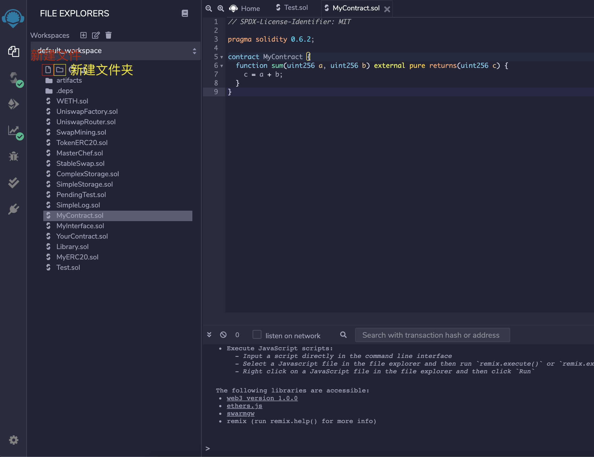
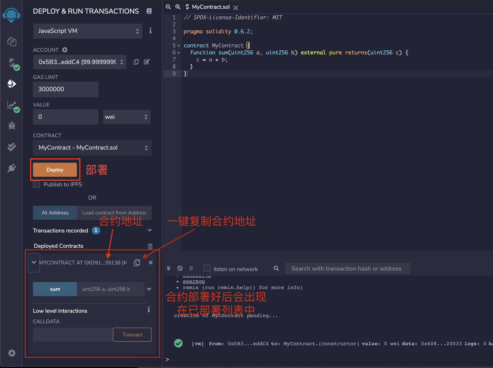
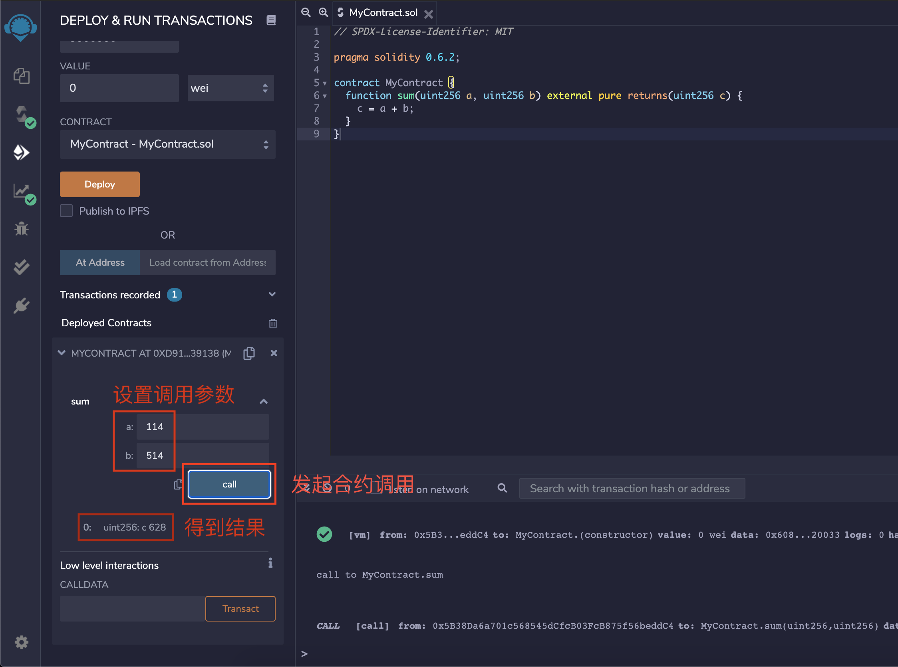

# 第一课

## 简介

### 什么是以太坊智能合约?

每个以太坊节点的内部都会运行一个 EVM(Ethereum Virtual Machine), 智能合约就是运行在 EVM 中的代码, 他通常具有一下一些特征

- 分布式, 去中心化

  智能合约一旦部署, 会在以太坊网络的所有节点中被复制和分发, 任何个人或组织无法把持

- 具有一致性并且可验证

  在同一个状态下(块高度, 哈希相同), 所有以太坊节点对于同一智能合约的相同输入参数的运行结果是一致的

- 图灵完备

- 不可篡改

  运行结果会以 merkle-patricia-trie 的方式存储在区块中, 确保结果不会被篡改

- 不可更新

  合约代码一旦部署, 无法修改

但同时, 他也存在一些局限性

- 无法进行网络请求

  由于网络请求的结果是不确定的, 并且是可以被攻击的, 为了保证一致性, 智能合约无法进行网络请求

- 只能持久化有限的数据, 并且费用高昂

  由于智能合约被复制的特性, 数据在持久化时, 在所有节点都要复制一遍. 因此为了确保整个网络的稳定性, 只能使用一些简单的容器在以太坊状态树中对有限的数据进行持久化

- 不可更新会导致漏洞难以被修复

### 什么是 Solidity?

理论上任何可以编译为 EVM 字节码的语言都可以用来编写智能合约, 而 Solidity 是目前主流的智能合约编写语言(其他的还有 Vyper), 其语法类似于 JavaScript

### 以太坊账户模型

在以太坊中, 一个账户包含四个字段, 分别是

- balance

  地址当前余额

- nonce

  地址的 nonce, 此地址每发起一笔交易, nonce 加 1. 若干笔 nonce 相同的交易中只有一笔会被打包. nonce 过大的交易会放入 queue 中, 等待打包. 可以简单的理解为, 是为了让用户控制交易顺序而设置的字段

- codeHash

  合约字节码的哈希, 根据此哈希可以在数据库中找到此地址对应的合约字节码, 合约账户才有此字段, 普通账户此字段用于为空

- storageRoot(stateRoot)

  账户状态树的根节点的哈希, 根据此哈希可以在数据库中找到一颗树的根节点(然后根据根节点可以找到这颗树中的任意一个节点), 这颗树里面记录了所有有关此地址的持久化数据

以太坊对普通账户和合约账户一视同仁. 一个地址可能是普通账户, 也可能是合约账户, 只取决于是否存在 codeHash 字段

### 以太坊交易

- 交易

  根据交易参数的不同, 可以分为: 普通转账交易、创建合约交易、合约调用交易. 在最新的 berlin 硬分叉之后, 前三种交易统称为 `LegacyTransaction`, 并且又增加了 `EIP2930AccessListTransaction` 交易

- 交易收据

  当一笔交易被以太坊节点打包时, 节点会为每一笔交易生成一个交易收据(receipt), 里面包含了这笔交易具体使用的 gas 数量以及输出的日志等信息

一笔普通的转账交易:

```json
// transaction
{
  "blockHash": "0x31b877d6a0b61e611bd8c52ddfdf90cbf095348ce534dabf84b257ae8a848bcb",
  "blockNumber": "0x98f",
  "from": "0xb4ec1f6419d66bfacebdd5b53fa895a636473c39",
  "gas": "0x5208",
  "gasPrice": "0x3b9aca00",
  "hash": "0xd6f56d259a4ab5963e133af8080955927182b3a12692cd8b4acbdca3a09192bb",
  "input": "0x",
  "nonce": "0x0",
  "to": "0x92b4df021a4621d07f2cbdce327bdcd437a69990",
  "transactionIndex": "0x0",
  "value": "0x56bc75e2d63100000",
  "v": "0x60b0",
  "r": "0xf79d64403c0e2f20f0bc609be32af46f554109e49d05763323b8688cd7da168f",
  "s": "0x7ef2b2142b9f8974d3de3db2216ed81f1c12827217e3d0bf67ce1490dba0f907"
}
```

```json
// receipt
{
  "blockHash": "0x31b877d6a0b61e611bd8c52ddfdf90cbf095348ce534dabf84b257ae8a848bcb",
  "blockNumber": "0x98f",
  "contractAddress": null,
  "cumulativeGasUsed": "0x5208",
  "from": "0xb4ec1f6419d66bfacebdd5b53fa895a636473c39",
  "gasUsed": "0x5208",
  "logs": [],
  "logsBloom": "0x00000000000000000000000000000000000000000000000000000000000000000000000000000000000000000000000000000000000000000000000000000000000000000000000000000000000000000000000000000000000000000000000000000000000000000000000000000000000000000000000000000000000000000000000000000000000000000000000000000000000000000000000000000000000000000000000000000000000000000000000000000000000000000000000000000000000000000000000000000000000000000000000000000000000000000000000000000000000000000000000000000000000000000000000000000000",
  "status": "0x1",
  "to": "0x92b4df021a4621d07f2cbdce327bdcd437a69990",
  "transactionHash": "0xd6f56d259a4ab5963e133af8080955927182b3a12692cd8b4acbdca3a09192bb",
  "transactionIndex": "0x0"
}
```

一笔创建合约的交易:

```json
// transaction
{
  "blockHash": "0x7678aad64c420eef77839cdd8a4cd562166cd520fc81e2d579b897dc1f60e35b",
  "blockNumber": "0xa09",
  "from": "0xb4ec1f6419d66bfacebdd5b53fa895a636473c39",
  "gas": "0x16387",
  "gasPrice": "0x1",
  "hash": "0xb539e05ec11e8b3cceeba78bbd98f95c8f47d48563b43320d46af229ea805622",
  "input": "0x6080604052348015600f57600080fd5b506040516100d93803806100d983398181016040526020811015603157600080fd5b50506098806100416000396000f3fe6080604052348015600f57600080fd5b506004361060285760003560e01c8063f42c13bf14602d575b600080fd5b60336035565b005b60405133907fb8a00d6d8ca1be30bfec34d8f97e55f0f0fd9eeb7fb46e030516363d4cfe1ad690600090a256fea2646970667358221220e8f1f8489264b1dfa4a65de6338e8d7952eff655284f07fefb9cd7d41a501ff164736f6c634300060200330000000000000000000000000000000000000000000000000000000000000001",
  "nonce": "0x3",
  "to": null,
  "transactionIndex": "0x0",
  "value": "0x0",
  "v": "0x60af",
  "r": "0x6db42ad11c6ef81771c480701b66551acbc31948028046ccbcc2815f364ccac1",
  "s": "0x7df760aedf93872323162babd8b2e2775bf2d51e4e84e46c5c2bb1da7dc1ee00"
}
```

```json
// receipt
{
  "blockHash": "0x7678aad64c420eef77839cdd8a4cd562166cd520fc81e2d579b897dc1f60e35b",
  "blockNumber": "0xa09",
  "contractAddress": "0xf4625b6c83201a695e37eb777d7954d7192fe1fa",
  "cumulativeGasUsed": "0x153d7",
  "from": "0xb4ec1f6419d66bfacebdd5b53fa895a636473c39",
  "gasUsed": "0x0153d7",
  "logs": [],
  "logsBloom": "0x00000000000000000000000000000000000000000000000000000000000000000000000000000000000000000000000000000000000000000000000000000000000000000000000000000000000000000000000000000000000000000000000000000000000000000000000000000000000000000000000000000000000000000000000000000000000000000000000000000000000000000000000000000000000000000000000000000000000000000000000000000000000000000000000000000000000000000000000000000000000000000000000000000000000000000000000000000000000000000000000000000000000000000000000000000000",
  "status": "0x1",
  "transactionHash": "0xb539e05ec11e8b3cceeba78bbd98f95c8f47d48563b43320d46af229ea805622",
  "transactionIndex": "0x0"
}
```

一笔调用合约的交易:

```json
// transaction
{
  "blockHash": "0xc4ca818e4b3bd10b179f92be311820fe2900db4843d2bec4269a6e70b1078323",
  "blockNumber": "0xa75",
  "from": "0xb4ec1f6419d66bfacebdd5b53fa895a636473c39",
  "gas": "0x5bd3",
  "gasPrice": "0x1",
  "hash": "0x235e1d1cc159a414dc20ee43ae5ae42de02ba19e135a91d16985db39a1ca21d8",
  "input": "0x34c9165b0000000000000000000000000000000000000000000000000000000000000001",
  "nonce": "0x5",
  "to": "0xf4625b6c83201a695e37eb777d7954d7192fe1fa",
  "transactionIndex": "0x0",
  "value": "0x0",
  "v": "0x60af",
  "r": "0x751ded72e7ae71c8909b61de26c74d0c4034387eabb2953db70d59d4bf979747",
  "s": "0xf31a04189b96fd67ba2c63149e6a1ef5a1ae5a59e34698a372d8154a4bb587d"
}
```

```json
// receipt
{
  "blockHash": "0xc4ca818e4b3bd10b179f92be311820fe2900db4843d2bec4269a6e70b1078323",
  "blockNumber": "0xa75",
  "contractAddress": null,
  "cumulativeGasUsed": "0x5973",
  "from": "0xb4ec1f6419d66bfacebdd5b53fa895a636473c39",
  "gasUsed": "0x5973",
  "logs": [
    {
      "address": "0xf4625b6c83201a695e37eb777d7954d7192fe1fa",
      "blockHash": "0xc4ca818e4b3bd10b179f92be311820fe2900db4843d2bec4269a6e70b1078323",
      "blockNumber": "0xa75",
      "data": "0x",
      "logIndex": "0x0",
      "topics": [
        "0xf950957d2407bed19dc99b718b46b4ce6090c05589006dfb86fd22c34865b23e",
        "0x000000000000000000000000b4ec1f6419d66bfacebdd5b53fa895a636473c39",
        "0x0000000000000000000000000000000000000000000000000000000000000001"
      ],
      "transactionHash": "0x235e1d1cc159a414dc20ee43ae5ae42de02ba19e135a91d16985db39a1ca21d8",
      "transactionIndex": "0x0"
    }
  ],
  "logsBloom": "0x00000000000000000000000000000000000000000000000000000000000000000000000020000000000000000000000000000000000000000100000000040000000000080000000000000000000000000000000000040020000000000000000000000000000000000000000000000000000000000000000000000000000000000000000000040000000000000000000000000000000000000000000000000000000000000000000000000000000000000000000000000000000000000000000000000000004000000000000000000000000000010000000000000000000040000008000000000000000000000000000000200000000000000000000000000000",
  "status": "0x1",
  "to": "0xf4625b6c83201a695e37eb777d7954d7192fe1fa",
  "transactionHash": "0x235e1d1cc159a414dc20ee43ae5ae42de02ba19e135a91d16985db39a1ca21d8",
  "transactionIndex": "0x0"
}
```

综上可得:

- 普通转账时, `input` 为空
- 创建合约时, `input` 为合约字节码及构造函数的参数,`to` 为 `null`, 并且在交易收据中会返回创建的合约的地址
- 调用合约时, `input`为`function selector`加上调用参数, 并且如果合约打印日志的话, 可以在其收据中获取

## 准备工作

推荐使用 Remix 作为 IDE, 因为他便捷简单, 适合初学者

1. 打开[Remix IDE](http://remix.ethereum.org/)


2. 切换到文件浏览器页面, 新建文件并编写合约

```solidity
// SPDX-License-Identifier: MIT

pragma solidity 0.6.2;

contract MyContract {
  function sum(uint256 a, uint256 b) external pure returns(uint256 c) {
    c = a + b;
  }
}
```



3. 切换到编译器选项页面, 编译合约


4. 切换到部署/调用合约页面, 部署合约



5. 切换到部署/调用合约页面, 与合约交互



## Solidity

[官方文档](https://docs.soliditylang.org/en/latest/)

### 文件结构

#### 协议声明

协议声明需要写在每个文件最开头的地方

```solidity
// SPDX-License-Identifier: MIT
```

```solidity
// SPDX-License-Identifier: GPL-3.0
```

#### 编译器版本声明

```solidity
pragma solidity ^0.4.0;
```

`0.4.0` 以上但是 `0.5.0` 以下

```solidity
pragma solidity 0.6.2;
```

```solidity
pragma solidity =0.6.2;
```

必须是`0.6.2`

```solidity
pragma solidity >=0.6.2 <0.8.5;
```

`0.6.2` 以上但是 `0.8.5` 以下

编译器版本声明的行为基本与 npm 的行为一致

#### 导入其他的源文件

```solidity
import "filename";
import * as symbolName from "filename";
import { symbol1 as alias, symbol2 } from "filename";
import "filename" as symbolName;
```

导入声明的行为基本与 typescript 一致, 一般使用第一种即可

```solidity
import "https://github.com/.../filename.sol";
```

Remix 提供了一种特殊的导入方式, 可以直接通过 url 导入文件

#### 注释

```solidity
// This is a single-line comment.

/*
This is a
multi-line comment.
*/
```

### 常用类型

#### `bool`布尔类型

布尔类型只能是`true`或者`false`

#### 整数类型

无符号整数范围为`uint8`,`uint16`,`uint32`, ..., `uint256`, 有符号整数范围为`int8`,`int16`,`int32`, ...,`int256`
其中`uint`/`int`是`uint256`/`int256`的别名

整数之间除法的结果也是整数(`5`/`2`=`2`)

#### `Address`地址类型

地址类型持有一个 20 字节的数组(和以太坊地址长度一样)

成员及方法:

- `balance` 地址当前的余额
- `transfer(uint256 amount)` 向该地址转账(接受转账的地址必须被`payable`修饰)

  ```solidity
  address addr = 0xb4eC1F6419d66bfaCEBdd5b53FA895a636473C39;
  // 无法为不是payable的地址转账
  // addr.transfer(1 ether);
  // 转换后可以转账
  payable(addr).transfer(1 ether);

  address payable addr2 = 0xb4eC1F6419d66bfaCEBdd5b53FA895a636473C39;
  // 可以转账
  addr2.transfer(1 ether);
  ```

- `send`,`call`,`callcode`,`delegatecall` 底层函数调用, 不建议直接使用, 具体使用参考文档

#### 固定长度的字节数组

从`bytes1`,`bytes2`,`bytes3`, ..., 到`bytes32`
其中`byte`是`bytes1`的别名

成员及方法:

- `length` 数组长度

#### 变长数组

`bytes`是变长字节数组的别名(不是单独的类型)

`string`是变长 UTF-8 编码字符数组的别名(不是单独的类型)

成员及方法:

- `length` 数组长度
- `push(x)` 增加一个元素到数组末尾
- `pop()` 移除一个数组末尾的元素

在内存中创建变长数组:

```solidity
contract C {
    function f(uint len) public pure {
        uint[] memory a = new uint[](7);
        bytes memory b = new bytes(len);
        // Here we have a.length == 7 and b.length == len
        a[6] = 8;
    }
}
```

变长数组作为成员变量:

```solidity
contract C {
    uint256[] public list;
    // 一般需要提供一个获取数组长度的公开方法, 这样外部才能知道数组的长度
    function len() external view returns (uint256) {
      return list.length;
    }
    function f(uint256 ele) external {
        list.push(ele);
    }
}
```

删除没有用的数组元素(删除元素可以为整个网络节省出更多的状态树存储空间, 并且还有 gas 费返还, 是一个良好的习惯):

```solidity
contract C {
  uint256[] public array = [1,2,3];
  // 一般需要提供一个获取数组长度的公开方法, 这样外部才能知道数组的长度
  function len() external view returns (uint256) {
    return array.length;
  }
  // 被删除的元素会变成下一个元素, 数组长度减少1
  function removeAtIndexAndShift(uint index) external {
    if (index >= array.length) return;
    for (uint i = index; i < array.length-1; i++) {
      array[i] = array[i+1];
    }
    array.pop();
  }
  // 被删除的元素会变成0
  function removeAtIndex(uint index) external {
    if (index >= array.length) return;
    delete array[index];
  }
}
```

#### `mapping`哈希表

`mapping(_KeyType => _ValueType)` 声明一个从`_KeyType`到`_ValueType`的哈希表, `_KeyType`只能是内置类型

由于 EVM 特殊的存储结构

- `mapping` 无法作为局部变量, 只能作为合约或结构体的成员变量
- `mapping` 无法遍历(但有些第三方库实现了这个功能, 本质是一个 mapping 加上一个 array)

可以使用`[]`操作符与哈希表中的值交互:

```solidity
contract C {
  mapping(address => uint256) public balanceOf;
  function f() public {
    address addr = 0xb4eC1F6419d66bfaCEBdd5b53FA895a636473C39;
    balanceOf[addr] = 100;
  }
}
```

判断键是否存在:

```solidity
contract C {
  struct S {
    uint256 amount;
    address sender;
  }
  mapping(address => S) public userInfo;
  mapping(address => uint256) public balanceOf;

  function f1() public view returns(bool) {
    return balanceOf[msg.sender] == 0;
  }

  function f2() public view returns(bool) {
    S storage s = userInfo[msg.sender];
    return s.sender == address(0);
  }
}
```

删除没有用的键(删除键可以为整个网络节省出更多的状态树存储空间, 并且还有 gas 费返还, 是一个良好的习惯):

```solidity
contract C {
  mapping(address => uint256) public balanceOf;

  function f() public {
    delete balanceOf[msg.sender];
  }
}
```

### 全局变量和函数

#### 单位

```solidity
assert(1 wei == 1);
assert(1 gwei == 1e9);
assert(1 ether == 1e18);
```

```solidity
assert(1 == 1 seconds);
assert(1 minutes == 60 seconds);
assert(1 hours == 60 minutes);
assert(1 days == 24 hours);
assert(1 weeks == 7 days);
```

#### 全局变量

`block.chainid`(`uint`) chainID

`block.coinbase`(`address payable`) 当前区块矿工地址

`block.difficulty`(`uint`) 当前区块难度

`block.gaslimit`(`uint`) 当前区块 gasLimit

`block.number`(`uint`) 当前区块高度

`block.timestamp`(`uint`) 当前区块时间戳

`msg.data`(`bytes calldata`) 交易的 input

`msg.sender`(`address`) 合约的直接调用者

`msg.sig`(`bytes4`) 交易 input 的前四个字节(`function selector`)

`msg.value`(`uint`) 交易转账的金额

`tx.gasprice`(`uint`) 交易设置的 gas 价格

`tx.origin`(`address`) 发起交易的地址

`this`(`address`) 合约自己的地址

#### 全局函数

`gasleft() returns (uint256)` 返回剩余的 gas 数量

`blockhash(uint blockNumber) returns (bytes32)` 返回指定高度的哈希

`abi.encodePacked(...) returns (bytes memory)` abi 非标准模式编码, 这样编码出来更节省空间, 一般用于计算多个字段的哈希. 由于是非标准模式编码, 其结果是模糊的, 因此无法解码

`assert(bool condition)` 如果 `condition` 为 `false` 则触发回滚

`require(bool condition)` 如果 `condition` 为 `false` 则触发回滚

`require(bool condition, string memory message)`如果 `condition` 为 `false` 则触发回滚, 并展示错误信息

`keccak256(bytes memory) returns (bytes32)` 计算 keccak256 哈希

`sha256(bytes memory) returns (bytes32)` 计算 sha256 哈希

`ripemd160(bytes memory) returns (bytes20)` 计算 ripemd160 哈希

`ecrecover(bytes32 hash, uint8 v, bytes32 r, bytes32 s) returns (address)` 恢复签名的地址

`selfdestruct(address payable recipient)` 向 `recipient` 发送合约中所有的 ETH, 并自毁(自毁后合约中的数据都将从状态树中删除, 并且无法再调用)

### 使用例子

#### 声明合约及其成员变量

```solidity
// 声明合约使用contract关键字, Solidity 中的合约就是其他语言中的类
contract SimpleStorage {
  // 声明枚举使用enum关键字
  enum State { Created, Locked, Inactive }
  // 声明结构体使用struct关键字
  struct Voter {
      uint weight;
      bool voted;
      address delegate;
      uint vote;
      // 该结构体持有一个枚举变量
      State state;
  }

  // 声明一个uint256类型的成员变量, 并且他可以直接被外部或内部访问
  uint public storedData;
  // 声明一个从address到Voter的哈希表, 并且他只能从内部访问
  mapping(address => Voter) private voters;

  // 声明合约的构造函数, 构造函数必须是public的, 构造函数在部署合约的时候会被调用
  constructor(uint256 index) public {
    // ...
  }
}
```

#### 声明函数

```solidity
contract SimpleStorage {
    function func1() external {
        // ...
    }

    function func2(uint256 num1, uint256 num2) external payable returns(uint256 sum1, uint256 sum2) {
        // ...
    }
}
```

函数使用`function`关键字进行声明, 依次是

```solidity
function 函数名(类型1 形参1, 类型2 形参2) external/public/internal/private pure/view/payable
```

如果有返回值的话最后需要加上`returns (类型1, 类型2)`来声明返回类型

其中:

- `external`关键字代表此函数只能被外部访问
- `public`关键字代表此函数可以同时被外部和内部访问
- `internal`关键字代表此函数可以被内部和子类访问
- `private`关键字代表此函数只能被内部访问

其中:

- `pure`关键字代表此函数无法访问状态树
- `view`关键字代表此函数可以访问状态树, 但无法修改
- `payable`关键字代表此函数可以接受转账(调用时, 交易中的`value`可以不为 0)
- 如果需要访问并修改状态树, 但不接受转账, 则在此处无需加关键字

#### 声明并使用修饰符

```solidity
contract SimpleStorage {
    address public seller1;
    address public seller2;

    modifier onlySeller() { // Modifier
        require(msg.sender == seller1);
        _;
        require(msg.sender == seller2);
    }

    function func() external onlySeller {
        // ...
    }
}
```

修饰符使用`modifier`关键字进行声明, 一般用于对某些字段进行统一的检查, 用`_;`表示继续运行原函数的代码

#### 声明并触发事件

```solidity
contract SimpleAuction {
    event HighestBidIncreased(address indexed bidder, uint amount); // Event

    function bid() public payable {
        // ...
        emit HighestBidIncreased(msg.sender, msg.value); // Triggering event
    }
}
```

触发事件后, 可以在 receipt 中找到相关的信息, 如果订阅了这种事件, 也可以收到节点的通知

- `indexed`关键字代表以太坊会为事件中的这个字段创建索引, 一个事件最多只能为三个参数创建索引, 建立索引可以提高查询日志的效率

#### 声明并使用接口

接口类似合约, 但不包含任何具体的实现, 一般用于跨合约调用以及解耦合, e.g.

```solidity
// MyInterface.sol
// SPDX-License-Identifier: MIT

pragma solidity 0.6.2;

interface MyInterface {
  function sum(uint256, uint256) external view returns(uint256);
}
```

```solidity
// MyContract.sol
// SPDX-License-Identifier: MIT

pragma solidity 0.6.2;

import "./MyInterface.sol";

contract MyContract is MyInterface {
  function sum(uint256 a, uint256 b) external view override returns(uint256 c) {
    c = a + b;
  }
}
```

```solidity
// YourContract.sol
// SPDX-License-Identifier: MIT

pragma solidity 0.6.2;

import "./MyInterface.sol";

contract YourContract {
  MyInterface public myInterface;

  constructor(address addr) public {
    myInterface = MyInterface(addr);
  }

  function calc(uint256 a, uint256 b) external view returns (uint256 c) {
    c = myInterface.sum(a, b);
  }
}
```

#### 声明并使用库

```solidity
// SPDX-License-Identifier: MIT

pragma solidity 0.6.2;

library MyLibrary {
    function add(uint256 self, uint256 a) public pure returns(uint256 b) {
        b = self + a;
        require(b >= self, "addition overflow");
    }
    function sub(uint256 self, uint256 a) public pure returns(uint256 b) {
        require(self >= a, "subtraction overflow");
        b = self - a;
    }
}

contract MyContract {
    using MyLibrary for uint256;

    // 使用using for
    function calc1(uint256 a) public pure returns(uint256 b) {
        b = a.add(1).sub(2);
    }

    // 不使用using for
    function calc2(uint256 a) public pure returns(uint256 b) {
        b = MyLibrary.sub(MyLibrary.add(a, 1), 2);
    }
}
```

库类似合约, 但库不能被实例化. 使用`using lib for xxx`后, 库中所有的函数都会变成`xxx`类的成员函数, 并且函数的第一个参数都会被自动换成`xxx`类的实例

## Transaction 和 Call 的区别

```solidity
// SPDX-License-Identifier: MIT

pragma solidity 0.6.2;

contract MyContract {
    uint256 public storageData;
    uint256[] public storageList;
    mapping(address => uint256) public storageMap;

    // 一般需要提供一个获取数组长度的公开方法, 这样外部才能知道数组的长度
    function len() external view returns (uint256) {
      return storageList.length;
    }

    function sum(uint256 a, uint256 b) external pure returns(uint256 c) {
        c = a + b;
    }

    function set(uint256 num) external {
        storageData = num;
    }

    function get() external view returns(uint256) {
        return storageData + 1;
    }
}
```

- 外部可以直接查询设置为 `public` 的成员变量
- “黄色的方法”代表`payable`或任何需要改变以太坊状态树的方法, 因此需要发起一笔交易, 等待交易被打包后, 才能拿到结果
- “蓝色的方法”代表`pure`或`view`, 不会改变以太坊状态树, 因只需要进行几次只读的查询操作就能拿到结果

## 第一个智能合约

```solidity
// SPDX-License-Identifier: MIT

pragma solidity 0.6.2;

contract MyERC20 {
  // 用户余额
  mapping(address => uint256) public balanceOf;
  // 总发行量
  uint256 public totalSupply = 0;
  // 拥有者
  address public owner;

  // 转账事件
  event Transfer(address indexed from, address indexed to, uint256 indexed amount);

  modifier onlyOwner() {
    require(msg.sender == owner);
    _;
  }

  constructor() public {
    owner = msg.sender;
  }

  // 增发
  function mint(address to, uint256 amount) external onlyOwner {
    require(amount > 0, "amount must be greater than 0");
    balanceOf[to] += amount;
    totalSupply += amount;
    emit Transfer(address(0), to, amount);
  }

  // 销毁
  function burn(uint256 amount) external {
    require(amount > 0, "amount must be greater than 0");
    require(balanceOf[msg.sender] >= amount, "burn amount exceeds balance");
    balanceOf[msg.sender] -= amount;
    totalSupply -= amount;
    emit Transfer(msg.sender, address(0), amount);
  }

  // 转账
  function transfer(address to, uint256 amount) external {
    require(amount > 0, "amount must be greater than 0");
    require(balanceOf[msg.sender] >= amount, "transfer amount exceeds balance");
    require(msg.sender != to, "invalid transfer");
    balanceOf[msg.sender] -= amount;
    balanceOf[to] += amount;
    emit Transfer(msg.sender, to, amount);
  }
}
```

## 课堂作业

实现一个银行合约存储 ETH, 实现以下功能

- 任何人可以充值任意数量的 ETH 到自己的账户(提示: 充值的函数需要加上`payable`以接受转账, 可以通过`msg.value`获取转账金额)
- 任何人可以转账自己的任意数量的 ETH 到别人的账户
- 任何人可以随时提取自己的任意数量的 ETH
- 需要提供查询余额的方法
- 充值、提现、转账都需要发出对应的事件

请将结果发到<samlior@foxmail.com>, 同时附上名字

<details>
<summary>参考答案</summary>

```solidity
// SPDX-License-Identifier: MIT

pragma solidity 0.6.2;

contract MyBank {
  // 用户余额
  mapping(address => uint256) public balanceOf;

  // 充值事件
  event Deposit(address indexed from, uint256 indexed amount);
  // 转账事件
  event Transfer(address indexed from, address indexed to, uint256 indexed amount);
  // 提现事件
  event Withdraw(address indexed from, uint256 indexed amount);

  // 充值
  function deposit() external payable {
    require(msg.value > 0, "value must be greater than 0");
    balanceOf[msg.sender] += msg.value;
    emit Deposit(msg.sender, msg.value);
  }

  // 提现
  function withdraw(uint256 amount) external {
    require(amount > 0, "amount must be greater than 0");
    require(balanceOf[msg.sender] >= amount, "withdraw amount exceeds balance");
    balanceOf[msg.sender] -= amount;
    msg.sender.transfer(amount);
    emit Withdraw(msg.sender, amount);
  }

  // 转账
  function transfer(address to, uint256 amount) external {
    require(amount > 0, "amount must be greater than 0");
    require(balanceOf[msg.sender] >= amount, "transfer amount exceeds balance");
    require(msg.sender != to, "invalid transfer");
    balanceOf[msg.sender] -= amount;
    balanceOf[to] += amount;
    emit Transfer(msg.sender, to, amount);
  }
}
```

</details>
