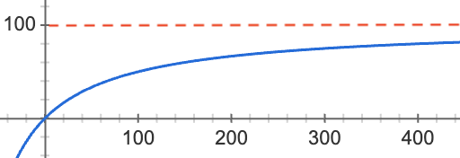

# 第三课

## UniswapV2 智能合约分析

### 什么是 Uniswap?

Uniswap 是一个由智能合约构成的去中心化交易所, 主要合约有三份[Pair](https://github.com/Uniswap/uniswap-v2-core/blob/master/contracts/UniswapV2Pair.sol), [Factory](https://github.com/Uniswap/uniswap-v2-core/blob/master/contracts/UniswapV2Factory.sol). [Router](https://github.com/Uniswap/uniswap-v2-periphery/blob/master/contracts/UniswapV2Router02.sol)

他只做两件事情

1. 让用户为指定的交易对质押流动性, Uniswap 会将指定的交易对的交易手续费均分给所有提供流动性的用户作为回报
2. 只要某两种资产已经被提供了流动性(并且路径相通), 任何人就可以通过 Uniswap 将任意数量的第一种资产换成第二种资产

### Uniswap 质押流动性

用户向 Uniswap 中质押资产时, 两种资产的比例必须与当前流动性池子中的资产比例一致. 质押资产后, Uniswap 会增发对应交易对的`liquidity`代币给用户, 作为流动性凭证. 具体计算公式如下

其中

- `liquidity` 为用户获得的`liquidity`代币数量
- `amountX` 为用户质押的第一种资产的数量
- `amountY` 为用户质押的第二种资产的数量
- `x` 为质押之前, 流动性池子中第一种资产的数量
- `y` 为质押之前, 流动性池子中第二种资产的数量
- `totalSupply` 为质押之前, `liquidity`代币的总发行量
- `minimumLiquidity` 为流动性池子的最小流动量, 固定为 1000

持有`liquidity`代币的用户可以随时通过销毁`liquidity`代币来赎回之前质押的资产. 具体计算公式如下

 

其中

- `liquidity` 为用户销毁的`liquidity`代币数量
- `amountX` 为用户可以赎回的第一种资产的数量
- `amountY` 为用户可以赎回的第二种资产的数量
- `x` 为赎回之前, 流动性池子中第一种资产的数量
- `y` 为赎回之前, 流动性池子中第二种资产的数量
- `totalSupply` 为赎回之前, `liquidity`代币的总发行量

### Uniswap 交易

Uniswap 会确保交换之前和交换之后两种资产数量相乘的积不变

其中

- `x` 为当前流动性池子中第一种资产的数量
- `y` 为当前流动性池子中第二种资产的数量
- `k` 为两种乘积

如果有用户通过 Unsiwap 用第一种资产交易出第二种资产, 可推出如下公式

其中

- ![deltax] 为用户输入的第一种资产的数量
- ![deltay] 为 Uniswap 输出的第二种资产的数量

经过变换可得

假设此时此刻 Uniswap 中有第一种资产 100 个, 第二种资产 100 个, 也就是

画出的曲线如下

虽然交换之前流动性池子中两种资产的比例为 1:1, 但根据曲线可以推导出, 输入数量为![deltax]的第一种资产是难以换出数量为![deltax]的第二种资产的(除非输入的数量非常非常小), 损失的部分![deltax] - ![deltay]就被称为`滑点损失`. 因此用户一次性交易的资产数量越多, 滑点损失越大

### Uniswap 交易手续费分成

Uniswap 目前对每一笔交易收取千分之 3 都手续费(上一节中的公式为了方便大家理解, 其实没有计算手续费)

如果设

那么有

经过变换可得

不计算手续费时, 用户输入![deltax]的第一种资产, 可以换出![deltay]的第二种资产, 计算手续费时, 用户输入![deltax]的第一种资产, 可以换出![deltay']的第二种资产, 因此有 ![deltay] - ![deltay'] 数量的第二种资产作为手续费被留在了流动性池子中, 那么此时收取的手续费可以表示为

如果此时是用第二种资产去交换第一种资产, 则道理相同, 收取的手续费可以表示为

综上, Uniswap 会对输出的资产收取一定数量的手续费, 这部分手续费就留在了 Uniswap 的流动性池子中. 假设在一个已经建立好流动性的交易对中, 存在两个时间点, 两个时间点之间没有任何用户进行质押或者赎回操作, 但存在若`n`笔从第一种资产到第二种资产的交易和`n'`笔第二种资产到第一种资产的交易, 此时收取的手续费可以表示为

 

假设一个用户持有数量为`liquidity`的流动性代币, 那么在开始的时间点, 他可以赎回的两种代币数量分别为

 

在结束的时间点, 他可以赎回的两种代币的数量分别为

 

这段时间内, 该用户的收益就可以表示为

 

[deltax]: <https://render.githubusercontent.com/render/math?math=%5cDelta x>
[deltay]: <https://render.githubusercontent.com/render/math?math=%5cDelta y>
[deltax']: <https://render.githubusercontent.com/render/math?math=%5cDelta x%27>
[deltay']: <https://render.githubusercontent.com/render/math?math=%5cDelta y%27>
